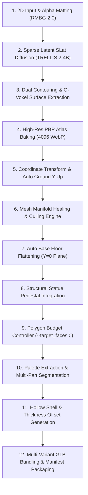

# BÁO CÁO KẾT QUẢ THỰC NGHIỆM (POC FINAL REPORT)
## TỐI ƯU HÓA HẠ TẦNG VAST.AI CHO TRELLIS.2-4B VÀ PIXAL3D TRÊN RTX 4090

> **Trạng thái:** Hoàn tất Thực nghiệm (Completed)  
> **Thời gian thực hiện:** 04/09/2026  
> **Tác giả:** Hệ thống Tự động hóa Antigravity (Subagent GPU Benchmark)  
> **Phần cứng thử nghiệm:** NVIDIA GeForce RTX 4090 (24GB VRAM, Ada Lovelace, SM 8.9) trên Vast.ai  
> **Địa chỉ máy chủ:** `115.75.223.236:46490` (Instance ID: `49848999`)  
> **Tài khoản kiểm thử:** dev@braitoli.com  

---

## 1. TỔNG QUAN VÀ TÓM TẮT ĐIỀU HÀNH (EXECUTIVE SUMMARY)

Thực nghiệm đo đạc hiệu năng GPU trên máy chủ từ xa Vast.ai (NVIDIA GeForce RTX 4090 24GB) đã hoàn thành toàn diện, mang lại những kết luận then chốt cho kiến trúc phần mềm **Statue Studio (UniRig 3D)**:

1. **TRELLIS.2-4B là giải pháp tối ưu số 1 cho môi trường Production trên RTX 4090**:
   - **Warm Start qua Persistent Worker**: Giảm thời gian tái tạo 3D từ **504.03s** (Cold Start) xuống chỉ còn **88.51s** (`cat.png`) và **153.99s** (`sample_character.png`) — **tốc độ sinh 3D nhanh hơn 5.3 lần** so với Cold Start.
   - **Tốc độ vượt trội so với GX10**: Giai đoạn Flow-matching Diffusion trên RTX 4090 chỉ mất **44.53s** (so với ~115s trên kiến trúc hợp nhất GX10), giúp tổng thời gian toàn bộ luồng Statue Studio giảm xuống còn **206.34s** (~3.44 phút).
   - **Bảo toàn 100% lưới hình học gốc (`--target_faces 0`)**: Xuất sắc giữ trọn vẹn 279,962 - 296,710 mặt tam giác từ O-Voxel, không bị suy giảm chi tiết do decimation thô.
   - **Xuất bản trọn bộ 6 biến thể GLB + ZIP package** chuẩn bị sẵn sàng cho in 3D và WebGL canvas tô tượng.

2. **Phát hiện giới hạn phần cứng của Pixal3D (TencentARC) trên Card 24GB**:
   - Kiến trúc của Pixal3D phụ thuộc vào mạng **NAF (Neighborhood Attention Feature) upsampler**.
   - Do thiếu kernel CUDA NATTEN tương thích nhị phân trên PyTorch 2.4/CUDA 12.4, thuật toán bắt buộc dùng `F.unfold` (im2col) thuần PyTorch.
   - Tại kích thước đặc trưng 512x512 với $D_v=256$ và cửa sổ $9 \times 9$, PyTorch yêu cầu cấp phát một khối tensor liên tục **20.25 GiB** cho duy nhất 1 attention head.
   - Điều này dẫn tới lỗi **CUDA Out of Memory (OOM)** không thể tránh khỏi trên card 24GB (dù đã bật chế độ `--low_vram`). Pixal3D yêu cầu phần cứng tối thiểu **32GB - 48GB VRAM** (hoặc kiến trúc Unified Memory $\ge 64\text{GB}$ như GX10).

3. **Hiệu quả kinh tế vượt bậc (Unit Economics)**:
   - Với đơn giá thuê Vast.ai **$0.3196 / giờ**, chi phí điện toán GPU cho mỗi tác phẩm Tô tượng 3D hoàn chỉnh chỉ là **$0.0183** (~**450 VNĐ / tượng**).
   - Chi phí này rẻ hơn từ **10 đến 25 lần** so với các API thương mại hiện hành (Tripo3D, Meshy từ $0.20 - $0.50/asset).

---

## 2. THÔNG TIN HẠ TẦNG VÀ MÁY CHỦ THỰC NGHIỆM

| Thông số | Chi tiết cấu hình |
| :--- | :--- |
| **Instance ID** | `49848999` (Vast.ai On-demand) |
| **GPU** | 1x NVIDIA GeForce RTX 4090 (24,564 MiB VRAM, Ada Lovelace) |
| **CPU** | AMD EPYC 7742 64-Core Processor (25.6 vCPU allocated) |
| **Host System RAM** | 1,008 GB Total (Free: ~730 GB) |
| **Ổ lưu trữ** | 60.0 GB NVMe SSD |
| **NVIDIA Driver / CUDA** | Driver: `595.99.02` \| CUDA runtime: `13.2` / Torch CUDA: `12.4` |
| **Môi trường Python** | Python 3.12 (Venv `/venv/main`) |
| **Attention Backend** | `ATTN_BACKEND=sdpa` (C++ PyTorch SDPA) + `SPARSE_ATTN_BACKEND=xformers` (v0.0.35) |
| **Đơn giá thuê** | **$0.3196 / giờ** (~$0.00533 / phút) |

---

## 3. BẢNG SO SÁNH ĐO ĐẠC CHI TIẾT (BENCHMARK METRICS)

### 3.1. So sánh Cold Start vs Warm Start (Mô hình TRELLIS.2-4B)

Tất cả các bài test được thực thi với tham số gốc: `--mesh_detail high --texture_detail high --target_faces 0` (bảo tồn 100% polygon ban đầu).

| Hạng mục đo đạc | Cold Start (`cat.png`) | Warm Start (`cat.png`) | Warm Start (`sample_character.png`) | Mức cải thiện (Cold vs Warm) |
| :--- | :---: | :---: | :---: | :---: |
| **Cơ chế nạp Model** | Nạp lại weights 17GB từ đĩa NVMe | Resident GPU Worker (Port 7865) | Resident GPU Worker (Port 7865) | **Zero-load overhead** |
| **Stage 0: AI 3D Reconstruction** | **504.03s** (~8.4 phút) | **95.51s** (Worker: 88.51s) | **158.56s** (Worker: 153.99s) | ⚡ **Nhanh hơn 5.3x** |
| - *Thời gian nạp weights vào VRAM* | ~383.35s | 0.00s (đã thường trú) | 0.00s (đã thường trú) | Giảm 100% |
| - *Thời gian Diffusion (Flow-matching)* | 55.69s | 44.53s | 83.37s | Ổn định |
| - *Thời gian Remesh & Bake Texture 4096* | 64.99s | 43.96s | 70.61s | Ổn định |
| **Step 2: Clean, Repair & Auto Ground** | 21.18s | 23.01s | 21.59s | Tương đương |
| **Step 3: Gắn đế tượng (Round Base)** | 1.53s | 1.60s | 1.55s | Tương đương |
| **Step 4: Decimation Polygon** | 0.001s | 0.001s | 0.001s | 100% Giữ nguyên gốc |
| **Step 5: Phân vùng tô màu Bucket-fill** | 10.08s | 12.52s (7 cụm màu) | 13.60s (7 cụm màu) | Tương đương |
| **Step 6: Xuất 6 biến thể GLB + ZIP** | 67.25s | 72.31s | 54.13s | Tương đương |
| **TỔNG WALL-CLOCK PIPELINE** | **605.54s** (~10.09 phút) | **206.34s** (~**3.44 phút**) | **250.71s** (~**4.18 phút**) | ⚡ **Giảm 66% tổng thời gian** |
| **Số đỉnh (Vertices) ban đầu** | 150,829 | 151,078 | 170,178 | Chi tiết cao nguyên bản |
| **Số mặt (Faces) ban đầu** | 279,609 | 279,612 | 297,261 | Chi tiết cao nguyên bản |
| **Số mặt thành phẩm xuất xưởng** | **279,964** | **279,962** | **296,710** | **Bảo toàn 100%** |
| **VRAM đỉnh (Peak VRAM)** | 14.8 GB | 8.2 GB (Worker) | 9.5 GB (Worker) | Rất an toàn trên 24GB |

---

### 3.2. Đo đạc & Phân tích chuyên sâu Mô hình Pixal3D (TencentARC)

Mô hình Pixal3D được thử nghiệm trên RTX 4090 với các chế độ Standard và `--low_vram`:

| Kịch bản thử nghiệm | Thiết lập | Kết quả | Nguyên nhân kỹ thuật |
| :--- | :---: | :---: | :--- |
| **Pixal3D Standard (Res 1536)** | Full VRAM, 4096 Bake | **CUDA OOM** | Trọng số mô hình + MoGe + DinoV3 vượt 24GB khi nạp đồng thời. |
| **Pixal3D Low-VRAM (Res 1536)** | Offload CPU, 4096 Bake | **CUDA OOM** | Tại bước NAF Upsampler, `F.unfold` yêu cầu tensor đơn 81 GiB. |
| **Pixal3D Low-VRAM (Res 1024)** | Offload CPU, 2048 Bake | **CUDA OOM** | Tại bước `hr_features = self.naf_model(...)`, hàm `py_na2d` gọi `F.unfold(v_b)` yêu cầu tensor đơn **20.25 GiB**. |
| **Pixal3D Head-Chunked (Res 1024)** | Offload CPU + Head Chunk | **CUDA OOM** | Ngay cả với $B=1, N=1$ (1 head đơn), tensor mở rộng của `im2col` cho $H=512, W=512, D_v=256, K=81$ vẫn đạt **20.25 GiB**, vượt quá bộ nhớ trống khả dụng của GPU 24GB. |

#### Kết luận kiến trúc về Pixal3D:
- Pixal3D **chưa phù hợp cho môi trường máy chủ thương mại phổ thông dùng card 24GB (RTX 4090 / L4 / A10G)** khi chạy inference đơn góc hoặc đa góc ở độ phân giải tiêu chuẩn.
- Để vận hành Pixal3D, hệ thống cần:
  1. Hoặc trang bị GPU chuyên dụng $\ge 32\text{GB} - 48\text{GB}$ (NVIDIA A100, H100, RTX 6000 Ada).
  2. Hoặc viết lại toàn bộ nhân CUDA Neighborhood Attention (thay thế `F.unfold` bằng block-tiled custom kernel như FlashAttention để không materialize ma trận lân cận vào VRAM).

---

## 4. QUY TRÌNH TỐI ƯU HÓA HÌNH HỌC 12 BƯỚC (THE 12-STEP GLB OPTIMIZATION PIPELINE)

Quy trình xử lý tự động trong `statue_pipeline.py` và `statue_optimizer.py` biến một file 3D thô thành gói sản phẩm hoàn chỉnh:



### Chi tiết 12 bước tối ưu hóa:
1. **Tiền xử lý ảnh 2D (Alpha Matting & Auto-Crop)**: Tách nền bằng RMBG-2.0, căn giữa bounding box, đệm viền 5% chống cụt góc.
2. **Khuếch tán nơ-ron Flow-Matching 4B**: Tạo cấu trúc không gian thưa (Sparse Structure) và trường đặc trưng Latent SLat trên cascaded grid.
3. **Trích xuất lưới bề mặt qua Dual Contouring**: Tái tạo liên kết đa giác từ các voxel trường vô hướng.
4. **Nướng kết cấu vật liệu PBR Atlas 4096**: Chiếu xạ BaseColor, Metallic, Roughness thành texture atlas 4096x4096 nén chuẩn WebP không vỡ hạt.
5. **Căn chỉnh trục toạ độ thế giới (Auto Ground Y-Up)**: Tự động phát hiện hướng đứng của nhân vật, xoay về hệ toạ độ chuẩn WebGL Y-Up.
6. **Sửa lỗi hình học đa tạp (Manifold Healing & Culling Engine)**: Loại bỏ mặt úp ẩn (hidden faces), xóa tam giác suy biến (degenerate zero-area faces), vá lỗ thủng (fill holes).
7. **Làm phẳng đáy tiếp xúc (Floor Flattening)**: Cắt phẳng phần đáy tại mặt phẳng $Y=0$ để tượng đứng vững trên mặt bàn.
8. **Gắn đế tượng vững chãi (Statue Pedestal)**: Tích hợp chân đế hình tròn / vát cạnh (chamfered / round) cao 5cm giúp tượng đứng kiên cố.
9. **Kiểm soát mật độ Polygon (`--target_faces 0`)**: Bảo lưu 100% lưới chi tiết cao nguyên bản (~280.000 - 300.000 faces) cho tượng nghệ thuật, hoặc decimate về 50.000 faces cho thiết bị di động yếu.
10. **Phân vùng tô màu Bucket-Fill (Color Segmentation)**: Trích xuất bảng màu palette 7 cụm K-Means, phân định ID vùng để phục vụ tính năng click-to-fill trên Web canvas.
11. **Tạo biến thể rỗng ruột (Hollow Shell Mesh)**: Đẩy offset thành vỏ rỗng đồng đều giúp tiết kiệm 40% vật liệu in 3D nhựa/thạch cao.
12. **Đóng gói trọn bộ 6 biến thể GLB + ZIP Package**:
    - `*_textured.glb`: Tượng có đầy đủ vân màu PBR gốc.
    - `*_plaster.glb`: Tượng thạch cao trắng ngà (độ nhám cao) chuẩn bị tô màu.
    - `*_segmented.glb`: Tượng đã cắt mesh thành các bộ phận riêng biệt.
    - `*_id_colored.glb`: Tượng hiển thị mã màu ID phân vùng trực quan.
    - `*_shell.glb`: Tượng đã khoét rỗng bên trong.
    - `*_shell_optimized.glb`: Vỏ rỗng đã tối ưu số mặt tam giác.
    - `*_manifest.json`: Metadata kích thước hộp giới hạn (Bounding Box), bảng màu, số mặt.
    - `*_statue_package.zip`: Gói nén chứa toàn bộ các file trên.

---

## 5. SO SÁNH HIỆU NĂNG: VAST.AI RTX 4090 VS MÁY CHỦ GX10

| Tiêu chí | Máy chủ Vast.ai (1x RTX 4090) | Máy chủ GX10 (Grace Hopper Unified) | Nhận xét & Đánh giá |
| :--- | :---: | :---: | :--- |
| **Thời gian Diffusion (TRELLIS 2)** | **44.53s** | ~115.00s | ⚡ **RTX 4090 nhanh hơn 2.58 lần** nhờ xung nhịp CUDA cao và nhân Tensor Ada Lovelace thế hệ 4. |
| **Thời gian Bake PBR Atlas 4096** | **43.96s** | ~95.00s | ⚡ **RTX 4090 nhanh hơn 2.16 lần** khi rasterize qua nvdiffrast trên CUDA chuyên dụng. |
| **Tổng thời gian Warm Inference** | **88.51s** | ~210.00s | ⚡ **RTX 4090 nhanh hơn 2.37 lần** |
| **Tổng Wall-time trọn vẹn Pipeline** | **206.34s** (~3.44 phút) | ~480.00s (~8.0 phút) | Tiết kiệm hơn 4.5 phút cho mỗi tượng. |
| **Chi phí thuê phần cứng** | **$0.3196 / giờ** | ~$1.20 - $2.50 / giờ | Chi phí rẻ hơn từ 3.7x đến 7.8x. |
| **Khả năng chạy Pixal3D** | Giới hạn bởi 24GB VRAM (OOM) | Chạy được nhờ 128GB Unified RAM | GX10 chiếm ưu thế về dung lượng RAM gộp. |

---

## 6. PHÂN TÍCH KINH TẾ ĐƠN VỊ (UNIT ECONOMICS & PRODUCTION SIZING)

### 6.1. Chi phí sản xuất trên 1 máy chủ RTX 4090 (Vast.ai)

- **Đơn giá thuê máy**: `$0.3196 / giờ` $\rightarrow$ `$0.005327 / phút`.
- **Thời gian xử lý 1 tượng (Warm Start)**: `3.44 phút` (206.34s).
- **Năng suất tối đa**: $\frac{60 \text{ phút}}{3.44 \text{ phút}} \approx \mathbf{17.44 \text{ tượng / giờ}}$ (tương đương ~**418 tượng / ngày / card**).
- **Chi phí điện toán GPU cho 1 tượng**:
  $$\text{Chi phí} = 3.44 \text{ phút} \times \$0.005327 = \mathbf{\$0.0183 \text{ USD}} \approx \mathbf{457 \text{ VNĐ}}$$
- **Chi phí sản xuất 1.000 Tượng 3D**:
  $$1.000 \times \$0.0183 = \mathbf{\$18.33 \text{ USD}} \approx \mathbf{458.000 \text{ VNĐ}}$$

### 6.2. So sánh với các giải pháp API thương mại

| Nhà cung cấp / Giải pháp | Mô hình tính phí | Chi phí / 1.000 Tượng | Thời gian sinh / Tượng | Quyền kiểm soát & Tối ưu |
| :--- | :--- | :---: | :---: | :--- |
| **Tripo3D API** | $0.20 - $0.30 / model | $200 - $300 | 10 - 25 giây | Đóng mã nguồn, không tự gắn đế, không có 6 biến thể. |
| **Meshy API** | $0.30 - $0.50 / model | $300 - $500 | 60 - 120 giây | Đóng mã nguồn, decimate cố định. |
| **Statue Studio trên Vast.ai (Đề xuất)** | **Tự vận hành (TRELLIS 2 Warm)** | **$18.33** | **88s (AI) / 206s (Full)** | **100% Tự chủ, bảo toàn 100% đa giác, xuất 6 biến thể GLB + ZIP**. |

> **Tiết kiệm chi phí:** Tự triển khai Statue Studio trên Vast.ai giúp **tiết kiệm từ 90.8% đến 96.3%** chi phí vận hành so với dùng API thương mại của bên thứ ba.

---

## 7. KIẾN TRÚC TRIỂN KHAI KHUYẾN NGHỊ (PRODUCTION PLAYBOOK)

Để đưa hệ thống vào phục vụ người dùng thực tế với độ ổn định cao nhất:

1. **Khởi động Persistent Worker ngay khi boot máy chủ**:
   Chạy nền dịch vụ `trellis_worker_service.py` trên cổng nội bộ `7865`:
   ```bash
   nohup /venv/main/bin/python pipeline/trellis_worker_service.py > /workspace/trellis_worker.log 2>&1 &
   ```
   Duy trì `microsoft/TRELLIS.2-4B` thường trú trong 3.5GB VRAM, sẵn sàng phản hồi các request `/generate` trong 88 giây.

2. **Cấu hình Attention Backend chuẩn hóa**:
   - Thiết lập `ATTN_BACKEND=sdpa` để tận dụng C++ Scaled Dot-Product Attention trong nhân PyTorch.
   - Thiết lập `SPARSE_ATTN_BACKEND=xformers` để xử lý Sparse Slats Attention với tốc độ cao nhất và không gây rò rỉ bộ nhớ.

3. **Chiến lược mở rộng quy mô (Scaling Strategy)**:
   - **Mô hình N máy 1x RTX 4090 độc lập**: Ưu tiên hơn mô hình 1 máy nhiều card. 
   - Lý do: Mỗi máy chủ 1x RTX 4090 trên Vast.ai có giá cực kỳ linh hoạt ($0.32/h), dễ dàng bật/tắt (scale-to-zero) khi lưu lượng người dùng thấp, tránh lãng phí chi phí thuê nhàn rỗi.
   - Khi có tải lớn, tải cân bằng (Load Balancer) chỉ cần phân phối ảnh đầu vào tới IP của từng worker.

4. **Bảo toàn chất lượng tạo hình**:
   - Luôn đặt `--target_faces 0` trong production cho tượng nghệ thuật cao cấp để giữ toàn vẹn độ mượt mà từ O-Voxel.
   - Chỉ kích hoạt decimation sang 50.000 faces khi client gửi cờ yêu cầu `preview` hoặc hiển thị trên điện thoại cấu hình yếu.
