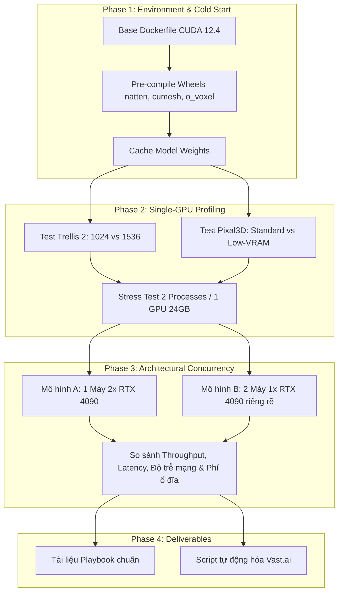

# KẾ HOẠCH VÀ DỰ TOÁN CHI PHÍ POC: TỐI ƯU HÓA HẠ TẦNG VAST.AI CHO TRELLIS.2-4B VÀ PIXAL3D

> **Tài liệu tham chiếu:** POC Hạ tầng GPU & Khảo sát kiến trúc Concurrency cho mô hình 3D SOTA  
> **Ngày lập:** 04/09/2026  
> **Nền tảng thực nghiệm:** Vast.ai Cloud GPUs  
> **Hai mô hình trọng tâm:**
> 1. **TRELLIS.2-4B** (Microsoft Research - 4B Parameters, Flow-matching Sparse Voxel / O-Voxel)
> 2. **Pixal3D** (TencentARC - Pixel-aligned Back-projection 3D Generation)

---

## 1. MỤC TIÊU VÀ BÀI TOÁN CẦN GIẢI QUYẾT

### 1.1. Mục tiêu kỹ thuật
1. **Benchmark tài nguyên thực tế:**
   * Đo đạc chính xác VRAM tiêu thụ (Baseline weights vs. Peak VRAM khi generate ở các độ phân giải $1024^3$ và $1536^3$).
   * Đo lường thời gian sinh (End-to-End Latency từ ảnh 2D đến GLB/PBR) của cả hai mô hình.
2. **Khảo sát giới hạn chạy song song (Concurrency Limits):**
   * *Intra-GPU Concurrency:* Card 24GB (RTX 4090) có thể chạy đồng thời 2 tiến trình Trellis 2 hoặc Pixal3D (với cờ `--low_vram`) mà không bị OOM hay không?
   * *Inter-GPU Concurrency:* So sánh hiệu năng giữa **1 máy Multi-GPU (1x máy 2 card 4090)** vs **N máy Single-GPU phân tán (2x máy 1 card 4090 độc lập)**.
3. **Triệt tiêu chi phí khởi động lạnh (Zero Cold-Start):**
   * Do cả 2 mô hình sử dụng chung các thư viện CUDA kernel chuyên biệt (`flash-attn`, `cumesh`, `o_voxel`, `nvdiffrast`, `natten`), PoC sẽ đóng gói 1 Base Docker Image pre-compile toàn bộ wheels. Giảm thời gian khởi tạo máy từ 30 phút xuống **< 2 phút**.

### 1.2. Mục tiêu kinh tế (Unit Economics)
* Xác định chính xác **Chi phí (USD) trên mỗi 1.000 file 3D hoàn chỉnh**.
* Đưa ra công thức tính điểm hòa vốn (Break-even Point) giữa phương án thuê máy cố định theo giờ vs phương án bật/tắt máy theo queue (Elastic Scale-to-Zero).

---

## 2. MA TRẬN THỰC NGHIỆM CHI TIẾT (TEST MATRIX)

### 2.1. Pha 1: Chuẩn hóa môi trường & Docker Image
* **Nền tảng:** `pytorch/pytorch:2.4.0-cuda12.4-cudnn9-devel`.
* **Cài đặt & Compile trước:**
  * `natten==0.21.0` (matching CUDA 12.4)
  * `flash-attn` (v2.6+ hoặc v3)
  * `cumesh`, `o_voxel`, `nvdiffrast`, `nvdiffrec_render`
  * `flex_gemm`
* **Lưu trữ Image:** Đẩy lên Docker Hub cá nhân hoặc đóng gói dạng Vast.ai Template để các instance sau chỉ mất thời gian pull layers.

### 2.2. Pha 2: Đo đạc chi tiết trên 1x RTX 4090 (Single-GPU)
Mỗi test case thực hiện lặp lại 5 lần trên 5 ảnh mẫu chuẩn (đối tượng đơn giản, vật thể phức tạp, nhân vật đầy đủ chi tiết):

| ID | Mô hình | Cấu hình chạy | Resolution | Chỉ số cần ghi nhận |
| :--- | :--- | :--- | :--- | :--- |
| **TC-01** | TRELLIS.2-4B | Standard (FP16) | 1024 | VRAM Peak, Inference Time, GLB Size |
| **TC-02** | TRELLIS.2-4B | Standard (FP16) | 1536 | VRAM Peak, Inference Time, Mesh Quality |
| **TC-03** | Pixal3D | Standard | 1024 | VRAM Peak, Inference Time, Texture Quality |
| **TC-04** | Pixal3D | Low-VRAM (`--low_vram`) | 1024 | VRAM Peak, CPU RAM Peak, Độ sụt giảm tốc độ |
| **TC-05** | Pixal3D | Standard | 1536 | VRAM Peak, Khả năng chịu tải VRAM |
| **TC-06** | Cả hai | Concurrency test: 2 workers trên 1 card 24GB | 1024 | Tỷ lệ lỗi OOM, Memory Contention Overhead |

### 2.3. Pha 3: So sánh 2 Mô hình chạy song song

#### **Mô hình A (Tập trung - 1 Máy 2x RTX 4090):**
* Chạy 2 tiến trình độc lập gán qua biến môi trường:
  * Tiến trình 1: `CUDA_VISIBLE_DEVICES=0`
  * Tiến trình 2: `CUDA_VISIBLE_DEVICES=1`
* Đo: Throughput tổng trong 30 phút, nhiệt độ 2 card, hiện tượng nghẽn bus PCIe nếu 2 card cùng nạp ảnh/lưu mesh.

#### **Mô hình B (Phân tán - 2 Máy 1x RTX 4090 độc lập):**
* Mỗi máy là 1 worker độc lập nhận job từ một Message Queue / HTTP endpoint đơn giản.
* Đo: Thời gian trễ mạng, chi phí duy trì ổ đĩa độc lập, sự linh hoạt khi scale-up/scale-down (tắt bớt 1 máy khi queue rỗng).

---

## 3. DỰ TOÁN CHI PHÍ THỰC HIỆN POC

### 3.1. Bảng giá tham chiếu thị trường Vast.ai (Máy Verified)
* **1x RTX 4090 (24GB):** ~$0.319 / giờ
* **2x RTX 4090 (48GB):** ~$0.558 / giờ
* **1x RTX 3090 (24GB - máy đối chứng nếu cần):** ~$0.113 / giờ
* **Lưu trữ ổ đĩa (Disk Storage):** ~$0.003 / GB / tháng (~$0.0002 / GB / ngày)
* **Băng thông (Data Transfer):** ~$0.004 – $0.006 / GB tải về

### 3.2. Bảng phân bổ chi phí và thời gian dự kiến

| Hạng mục thử nghiệm | Loại máy sử dụng | Thời gian máy chạy | Đơn giá / giờ | Thành tiền dự kiến |
| :--- | :--- | :--- | :--- | :--- |
| **Pha 1: Build & Verify Docker Image** | 1x RTX 4090 | 1.5 giờ | $0.32 /h | **$0.48** |
| **Pha 2: Benchmark Single-GPU (Trellis 2 & Pixal3D)** | 1x RTX 4090 | 1.5 giờ | $0.32 /h | **$0.48** |
| **Pha 2 (Đối chứng): Chạy test trên RTX 3090** | 1x RTX 3090 | 1.0 giờ | $0.12 /h | **$0.12** |
| **Pha 3A: Test máy tập trung (1 máy 2x 4090)** | 1 máy 2x 4090 | 1.0 giờ | $0.56 /h | **$0.56** |
| **Pha 3B: Test máy phân tán (2 máy 1x 4090)** | 2 máy 1x 4090 | 1.0 giờ | $0.64 /h ($0.32 x 2) | **$0.64** |
| **Phí phụ trợ (50GB disk + băng thông tải weights)** | Nhiều máy | Trong thời gian test | Cước thực tế | **$0.15** |
| **Dự phòng phát sinh (Re-run, fix lỗi script)** | 1x RTX 4090 | 1.0 giờ | $0.32 /h | **$0.32** |
| **TỔNG CỘNG DỰ TOÁN POC** | | **~7 giờ máy** | | **~$2.75 USD** |

### 3.3. Đánh giá tính khả thi ngân sách
* **Số dư hiện tại trong tài khoản:** **`$10.00 USD`** (Credit khả dụng).
* **Tỷ lệ tiêu hao dự kiến:** Chiếm khoảng **27.5%** ngân sách hiện có.
* **Kết luận:** Ngân sách hoàn toàn đủ cho toàn bộ các pha thử nghiệm mà **không cần nạp thêm bất kỳ chi phí nào**.

---

## 4. SẢN PHẨM ĐẦU RA CỦA POC (DELIVERABLES)

Khi hoàn tất PoC, hệ thống sẽ bàn giao các tài liệu và công cụ chuẩn hóa:

1. **`DOCKERFILE_3D_BASE`**:
   * Image chuẩn nhẹ nhất chứa PyTorch 2.4, CUDA 12.4, NATTEN, Flash-Attn, CUMESH, O-Voxel và Nvdiffrast.
2. **Báo cáo Benchmark Tổng hợp (`BENCHMARK_REPORT.md`)**:
   * Bảng ma trận VRAM thực tế và Latency đối đầu giữa Trellis 2 và Pixal3D.
   * Kết luận về việc chạy 2 tiến trình trên cùng 1 card 24GB.
3. **Bảng tính Đơn giá Sản xuất (Unit Economics Calculator)**:
   * Công thức tính: Chi phí thuê máy $\rightarrow$ Số asset tạo ra / ngày $\rightarrow$ Giá vốn / 1 asset 3D.
4. **Bộ công cụ tự động hóa Vast.ai (`vast_cluster_manager.py`)**:
   * Tự động tìm máy thỏa mãn giá tốt nhất.
   * Tạo instance và khởi động worker.
   * Tự động hủy máy (Destroy/Stop) khi xử lý xong lô ảnh để tránh phát sinh chi phí nhàn rỗi.
